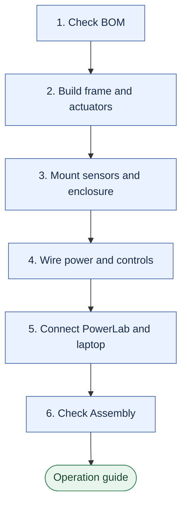

# Assembly guide

```mermaid
flowchart TD
    A["1. Check BOM"] --> B["2. Build frame and actuators"]
    B --> C["3. Mount sensors and enclosure"]
    C --> D["4. Wire power and controls"]
    D --> E["5. Connect PowerLab and laptop"]
    E --> F["6. Check Assembly"]
    F --> G(["Operation guide"])

    classDef assembly fill:#eaf2ff,stroke:#4263a8,color:#172b4d;
    classDef next fill:#e8f5ed,stroke:#328052,color:#18452b;
    class A,B,C,D,E,F assembly;
    class G next;
```

[Continue to the operation guide](operation.md).

